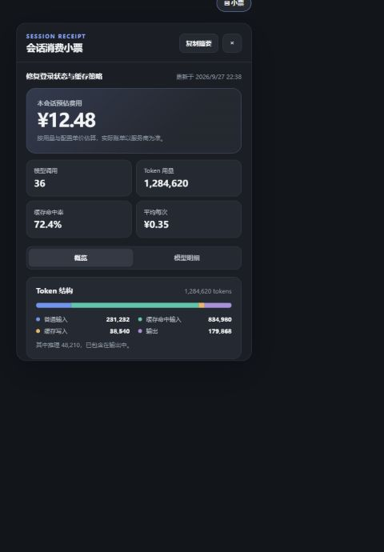
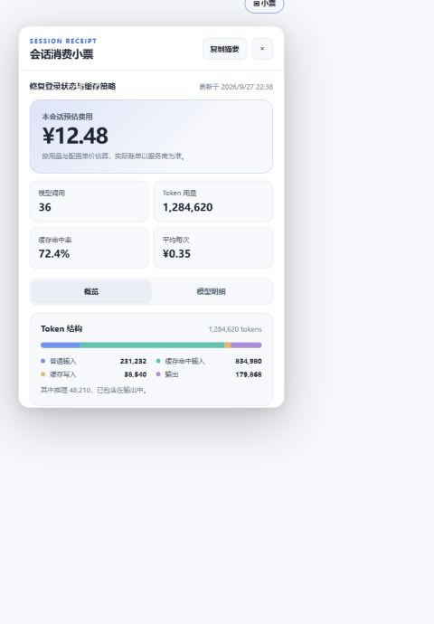
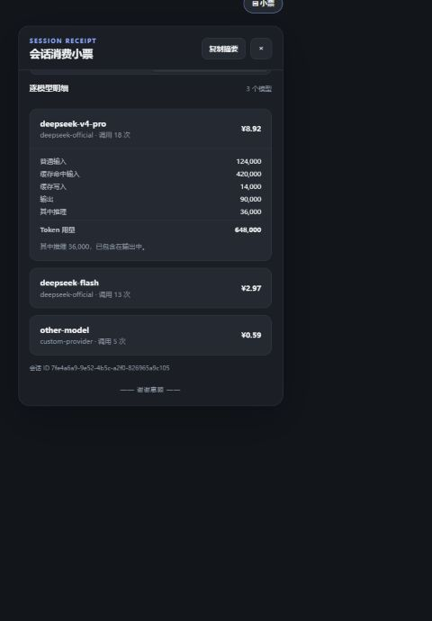
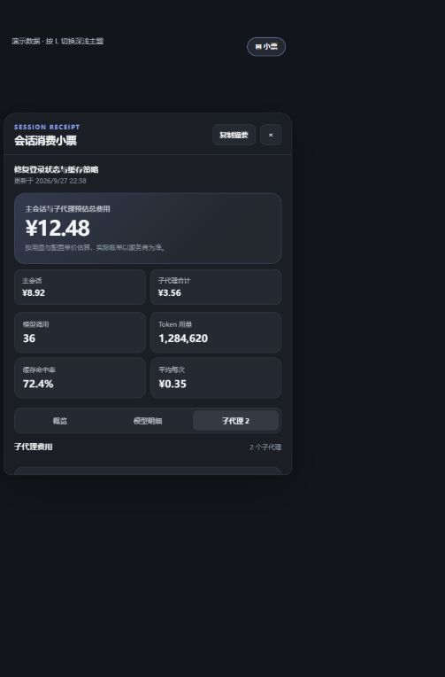
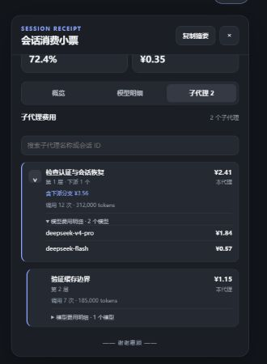

<p align="center"><a href="./README.md">中文</a> · English</p>

# dsh-receipt — Conversation usage receipt plugin

Adds a receipt button to the DeepSeek Harness conversation header. It opens a compact panel at the top right:

- **Overview**: estimated total for the main session and all nested subagents, their subtotals, model calls, total tokens, cache hit rate, and average cost per call;
- **Cost and usage mix**: four token buckets, cost/token share switching for up to five models, model time, and conversation span;
- **Per-model details**: expandable call count, token buckets, and calculable cost; reasoning tokens are included in output;
- **Subagent costs**: expand delegation levels and distinguish each agent's own cost from its entire descendant branch; search by name or session ID, load 20 siblings at a time, and inspect calls and model subtotals.
- **Useful controls**: copy a text summary, keyboard and narrow-screen support, light/dark themes, and reduced motion.

## Screenshots

These screenshots come from a local interactive preview. **All values and the session name are demo data**, not a real bill or a Desktop runtime capture. Open a conversation, click "Receipt" in its header, and select "View all model details" for the per-model view.

| Dark overview | Light overview | Per-model details |
| --- | --- | --- |
|  |  |  |

| Total with subagents | Individual subagent costs |
| --- | --- |
|  |  |

The subagent tab starts with top-level agents. Expand a row to reveal its direct children; search reveals the ancestor path to each match. Indentation is capped at four steps while each row still shows its actual depth.

Cache hit rate is `cached input / (regular input + cached input)`. When rates are
missing, the panel labels the total as the "known portion of cost" and shows
calculable model subtotals rather than implying that all usage is priced. The
default currency symbol is ¥ and can be configured. The update time is the last
counted event's timestamp.

The data is folded from the session log by a host-side `receipt` projection
unit (reusing `assistant/message` usage and model attribution) and refreshed in
real time via `session/projection` frames. The UI only renders; it issues no RPC.

[deepseek-harness-usage-dashboard](https://github.com/nzz0991999-ai/dsh-usage-dashboard)
offers an account-wide balance and billed-spend view from DeepSeek's platform.
This receipt borrows its cost/token distribution switch, while using only
recorded usage from one conversation and its subagents. It cannot replace the provider bill and
requires no platform login. The dashboard uses undocumented platform usage
endpoints, whose availability depends on DeepSeek's platform.

The total sums independent usage projections in the session tree. A forked subagent's inherited parent log is excluded to prevent double charging. Missing usage or unpriced models make the total a known subtotal. Subagents using another currency remain visible but are excluded from the sum.

## Installation

Install from GitHub (no local build required):

```sh
# Run from your DeepSeek Harness checkout (when the web profile matches the GUI's profile)
pnpm dsh plugin --profile web add github:bluechips-zhao/dsh-receipt
```

> If you're not comfortable with the command line, just paste this repo link
> `https://github.com/bluechips-zhao/dsh-receipt` to your AI assistant (e.g.
> DeepSeek Harness / any other AI) and let it run the `dsh plugin` install steps
> below for you.

After installing, **fully quit and restart the GUI** (the receipt button appears on the right of
the session header; open a conversation and click "Receipt"). Desktop and Web use separate profiles; install into the profile the GUI actually runs. A linked local plugin also needs a GUI restart after its client bundle changes.

### Discover more plugins

This plugin is published under the GitHub
[`dsh-plugin`](https://github.com/topics/dsh-plugin) topic, where official and
community plugin repos can be browsed. For a visual, app-store-like experience,
also check out the community-maintained
[DSH-Plugin Hub](https://dsh-plugin.org) (a third-party site, not operated by
DeepSeek).

> The repo **commits the built `lib/`** (`exports` point to `lib/index.js` and
> `lib/client.js`), so users install a ready-to-run artifact without building.
> If you rename this repo or move it to another namespace, update the
> `github:bluechips-zhao/dsh-receipt` segment above accordingly.

## Dependencies, permissions, and compatibility

- **External dependencies**: no external service, no network request, no command
  execution. At runtime the plugin only reads the host-side `receipt` projection and
  `useSessions` row data. Copy summary writes to the browser clipboard only after
  a user click. Every dependency goes through peer / profile fallback
  (`$DSH_HOME/profiles/node_modules`) and never duplicates the Cordis / React /
  schemastery runtime identity.
- **Permissions**: the runtime code (`lib/index.js`, `lib/client.js`) registers one
  projection unit and two slot seats — it does **not** touch the filesystem, read
  credentials, or spawn a subprocess. The host half injects only
  `sessionProjections`; the client half injects only `sessions` / `slots` / `locale`.
- **Build-time signals**: `tsdown.config.ts` uses `node:fs` to read and check emitted
  artifacts, and `scripts/*` read a few environment variables. Both belong to the
  build and self-check toolchain and are not published (`files` ships `lib/` and the
  docs only). A static scan that counts them as permission signals is reading the
  build surface, not the runtime surface.
- **Compatibility**: Node.js `^22.19.0 || >=24`; the per-version DSH declaration
  lives in `package.json` under `dsh.compatibility.dshReleases`. The client and
  host packages must be on the same version line; see Verification for `0.1.7-rc.2` evidence.
- **Known bounds**: costs are a local estimate from the configured pricing table, not
  a billing record; models missing from the table render as unpriced; peak/off-peak
  is decided from the sample event time (local clock).

## Build (maintainers)

Only **plugin authors/maintainers** need to build; regular users install the
`lib/` artifact directly.

Prerequisite: a checkout of the matching DSH tag. The build reads its browser
platform module table; this repository's lockfile provides the build tools:

```powershell
# Inside the dsh-receipt directory; adjust paths to your own machine layout
New-Item -ItemType Junction -Path harness     -Target "<your DeepSeek Harness checkout path>"
pnpm install --frozen-lockfile
```

Then:

```sh
pnpm run build      # tsc host + client type-check & output, tsdown emits lib/index.js + lib/client.js
```

Artifact contract: `lib/index.js` (host plugin entry), `lib/client.js` (browser
bundle, `window.__ModuleLoader__.load` wrapper), `lib/types/**` (types). The goal
of a build is to keep `lib/` in sync with `src/`; after changing `src/`, rebuild
and commit `lib/` before publishing.

## Configuration (pricing)

The plugin bundles the **off-peak prices** checked against DeepSeek's
[official pricing page](https://api-docs.deepseek.com/quick_start/pricing/) on **2026-09-27**:
`deepseek-flash` (V4.1-Flash) and `deepseek-v4-pro` (V4-Pro-0813). Historical
models no longer listed there show "unpriced" and cost 0. Time-of-day
(peak/off-peak) billing is folded automatically from each sample's time (next
section). The current official catalog lists these **two current models**;
`deepseek-v4-flash` and `deepseek-v4-flash-vision-exp` are accepted legacy names
billed at Flash rates. The receipt preserves the original model name from the
session log. A third-party provider using the same model ID also matches the
global default rate; use a `provider/model` override if its price differs.
Other historical models remain unpriced. A profile-level `pricing` entry overrides bundled defaults and
should be reviewed after plugin upgrades. To override a default, replace `config` (a full-section replacement) on
the `dsh-receipt` row in the profile's `cordis.patch.yml`:

```yaml
# In your profile's cordis.patch.yml (e.g. <DSH_HOME>/profiles/web/cordis.patch.yml)
- id: dsh-receipt
  config:
    currency: ¥
    pricing:
      # Both entries below are built in; shown here as override examples.
      # Unit: currency per 1M tokens, quoting the off-peak (trough) price.
      deepseek-flash: { input: 1, cacheRead: 0.02, output: 4 }
      deepseek-v4-pro: { input: 4.5, cacheRead: 0.15, output: 13.5 }
    # Published 2026 holidays are built in; add later years from official schedules.
    offPeakDates: ['2027-10-01']
```

- Price unit: **currency amount per 1M tokens**; fields: `input` / `cacheRead` /
  `cacheWrite` / `output` / `reasoning`. A bucket with usage but no rate marks
  the model unpriced; the total contains only calculable portions. The current
  official table does not give a separate cache-write rate, so configure one
  under your provider's actual billing rules if the adapter reports that usage.
- Key precedence: `provider/model` composite key, then model id, then the
  **same-price alias** base model (no cross-provider merge is performed).
- `deepseek-chat` and `deepseek-reasoner` have no bundled historical price.
  Configure the price applicable to an old conversation if you need an estimate;
  today's price does not reconstruct a historical bill.
- `reasoningTokens` is part of `outputTokens`. The receipt shows it as a detail,
  but does not add it twice to total tokens. A custom `reasoning` rate replaces
  the corresponding output portion; without one, all output uses the `output` rate.
- **Same-price alias**: the retired names `deepseek-v4-flash` and
  `deepseek-v4-flash-vision-exp` are still callable and are served by
  DeepSeek-V4.1-Flash at Flash prices, so the built-in `PRICING_ALIASES` maps both
  to `deepseek-flash` (configure a retired name separately and its own price wins).
- `currency` only affects the displayed symbol; config changes take effect
  **immediately** via the profile config HMR, no restart needed.

### Time-of-day (peak/off-peak) pricing notes (official pricing page)

Current DeepSeek models use **time-of-day pricing**. The official
[Models & Pricing](https://api-docs.deepseek.com/quick_start/pricing/) page
footnote (2) defines:

- **Peak hours**: Beijing time **Mon–Fri, excluding Chinese statutory holidays**,
  9:00–12:00 and 14:00–18:00.
- **Off-peak**: outside those windows, **including weekends (even make-up work weekends) and Chinese statutory holidays**.
- The off-peak price is **half** the peak price (peak = off-peak × 2, matching the
  built-in `peakMultiplier: 2`).

| Model | Window | Input (cache miss) | Input (cache hit) | Output |
|---|---|---|---|---|
| `deepseek-flash` (V4.1-Flash) | Off-peak (incl. weekends and holidays) | ¥1 | ¥0.02 | ¥4 |
| `deepseek-flash` | Non-holiday weekday peak 9:00–12:00, 14:00–18:00 | ¥2.0 | ¥0.04 | ¥8.0 |
| `deepseek-v4-pro` (V4-Pro-0813) | Off-peak (incl. weekends and holidays) | ¥4.5 | ¥0.15 | ¥13.5 |
| `deepseek-v4-pro` | Non-holiday weekday peak 9:00–12:00, 14:00–18:00 | ¥9.0 | ¥0.30 | ¥27.0 |

The receipt folds peak/off-peak from each step sample's timestamp: the built-in
prices are the **off-peak** ones; samples inside a weekday peak window are charged
`peakMultiplier` (default 2), and Saturdays/Sundays remain off-peak even when
designated as make-up workdays. The [published 2026 holiday schedule](https://www.gov.cn/zhengce/zhengceku/202511/content_7047091.htm)
is built in. Later years **are not updated automatically**: put Beijing dates
(`YYYY-MM-DD`) in `offPeakDates` from the official schedule, or those dates may
be overestimated. No manual
doubling is needed. Change the windows or multiplier through `peakHours` / `peakMultiplier`.
The plugin approximates billing time with the committed `assistant/message` time
and cannot include calls that did not land in the session; the amount remains an
estimate, and the provider bill is authoritative.

**Naming and retirement notes (official footnote 1)**: use `deepseek-flash`
as the model name; the retired names `deepseek-v4-flash` and
`deepseek-v4-flash-vision-exp` are still callable but are served by V4.1-Flash at
Flash prices (aliases built in). The current official table separately lists
`deepseek-v4-pro`, so the plugin retains its own price. Recheck the official
pricing page when prices change.

## Verification

Verified in an isolated `dsh-v0.1.7-rc.2` environment: `pnpm test`,
`pnpm typecheck`, `pnpm build`, profile plugin installation,
`--dump-config` composition, and Web host startup. An HTTP request without
that isolated host's access token returned the expected `401`. The redesigned
panel has been visually checked with synthetic projection data in a dark,
narrow viewport, and its type check and build pass. The DSH browser receipt
action, real provider events, and agreement with actual bills have not been
verified.

```sh
# Projection/folding logic unit assertions
pnpm test

# GUI end-to-end check (optional: needs the dsh web running on localhost:3080 and
# a Playwright Chromium; paths are configured via env vars, see the top of scripts/gui-check.mjs)
$env:RECEIPT_PLAYWRIGHT = '<DSH repo>/node_modules/.pnpm/playwright@<ver>/node_modules/playwright/index.js'
$env:RECEIPT_CHROMIUM    = '<your chromium.exe path>'
node scripts/gui-check.mjs

# Confirm the config layer is included in the composition
pnpm dsh --profile web --dump-config | findstr dsh-receipt
```

## Implementation notes

- Host half: the `receipt` projection unit in `src/projection.ts` — pure
  synchronous folding, state is plain JSON (persistable cache), `view` computes
  cost from the pricing table captured at registration; replacement semantics
  match `tokenUsage` (a repeated sample for one step replaces the previous one
  without double-counting — usage lands with `assistant/message`, and the current
  event map has no `assistant/chunk`).
- Client half: the "Receipt" button in `conversation.session.header.actions` +
  the receipt overlay in `shell.overlay`; open state is coordinated through a
  plugin-internal module-level store, and data is read from
  `projectionValues.receipt` on the `useSessions` row (real-time frame driven).
- Dependencies all go through peer / profile fallback
  (`$DSH_HOME/profiles/node_modules`); Cordis / React / schemastery runtime
  identity is not duplicated.
